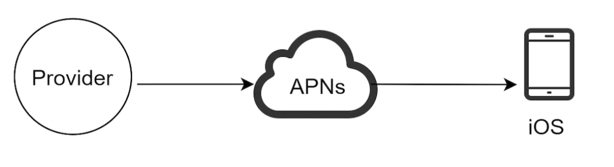
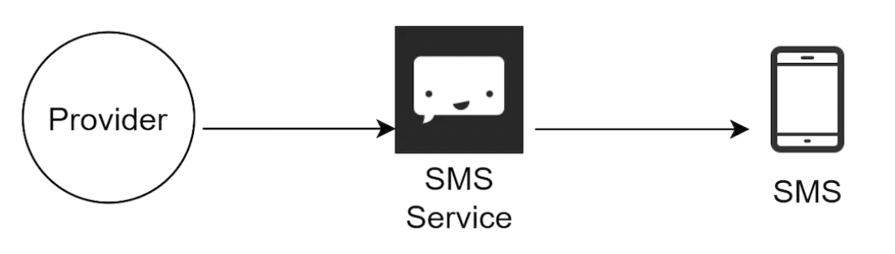
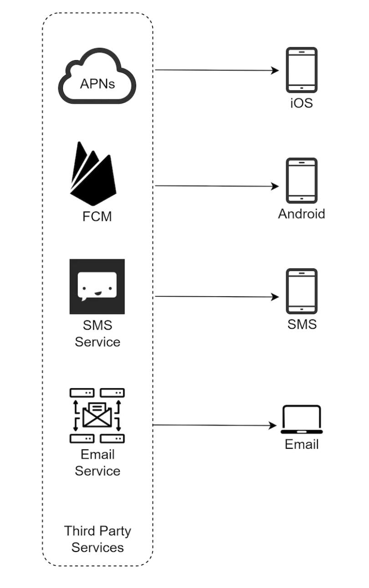
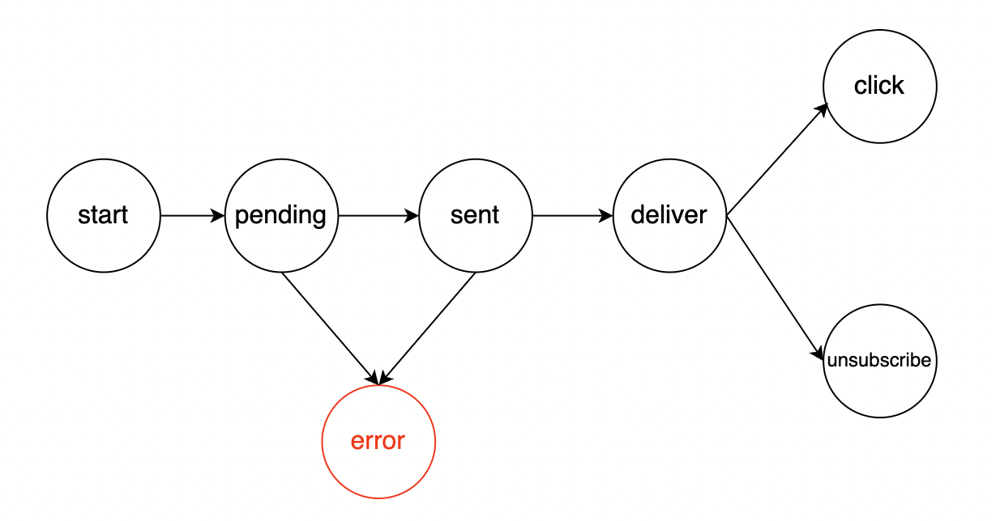
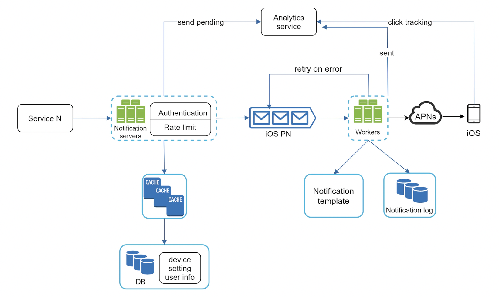

# Design a Notification System
Notification systems are a popular feature in many applications - it alerts a user for important news, product updates, events, etc.

There are multiple flavors of a notification:
 * Mobile push notification
 * SMS
 * Email

# Step 1 - Understand the problem and establish design scope
 * C: What types of notifications does the system support?
 * I: Push notifications, SMS, Email
 * C: Is it a real-time system?
 * I: Soft real-time. We want user to receive notification as soon as possible, but delays are okay if system is under high load.
 * C: What are the supported devices?
 * I: iOS devices, android devices, laptop/desktop.
 * C: What triggers notifications?
 * I: Notifications can be triggered by client applications or on the server-side.
 * C: Will users be able to opt-out?
 * I: Yes
 * C: How many notifications per day?
 * I: 10mil mobile push, 1mil SMS, 5mil email

# Step 2 - Propose high-level design and get buy-in
This section explores the high-level design of the notification system.

## Different types of notifications
How do the different notification types work at a high level?

### iOS push notification

 * Provider - builds and sends notification requests to Apple Push Notification Service (APNS). To do that, it needs some inputs:
   * Device token - unique identifier used for sending push notifications 
   * Payload - JSON payload for the notification, eg:
```
{
   "aps":{
      "alert":{
         "title":"Game Request",
         "body":"Bob wants to play chess",
         "action-loc-key":"PLAY"
      },
      "badge":5
   }
}
```
 * APNS - service, provided by Apple for sending mobile push notifications
 * iOS Device - end client, which receives the push Notifications

### Android Push Notification
Android adopts a similar approach. A common alternative to APNS is Firebase Cloud Messaging:


### SMS Message
For SMS, third-party providers like Twilio are available:


### Email
Although clients can setup their own mail servers, most clients opt-in to use third-party services, like Mailchimp:


Here's final design after including all notification providers:


## Example database tables for storing contact info:


## High-level design (improved)
Some changes from the original naive design:
 * Move database & cache out of the notification service
 * Add more notification servers & setup autoscaling & load balancing
 * Introduce message queues to decouple system components


 * Service 1 to N - services which send notifications within our system
 * Notification servers - provide APIs for sending notifications. Visible to internal services or verified clients. Do basic validation. Fetch notification templates from database. Put notification data in message queues for parallel processing.
 * Cache - user info, device info, notification templates
 * DB - stores data about users, notifications, settings, etc.
 * Message queues - Remove dependencies across components. They serve as buffers for notifications to be sent out. Each notification provider has a different message queue assigned to avoid outages in one third-party provider to affect the rest.
 * Workers - pull notification events from message queues and send them to corresponding third-party services.
 * Third-party services - already covered in initial design.
 * iOS, Android, SMS, Email - already covered in initial design.

Example API call to send an email:
```
{
   "to":[
      {
         "user_id":123456
      }
   ],
   "from":{
      "email":"from_address@example.com"
   },
   "subject":"Hello World!",
   "content":[
      {
         "type":"text/plain",
         "value":"Hello, World!"
      }
   ]
}
```

Example lifecycle of a notification:
 * Service makes a call to make a notification
 * Notification service fetch metadata (user info, settings, etc) from database/cache 
 * Notification event is sent to corresponding queue for processing for each third-party provider.
 * Workers pull notifications from the message queues and send them to third-party services.
 * Third-party services deliver nofications to end users.

# Step 3 - Design deep dive
In this section, we discuss some additional considerations for our improved design.

### Events tracking
We might have to track certain events related to a notification, eg open rate/click rate/etc.

Usually, this is done by integrating with an Analytics service, so we'll need to integrate our notification system with one.


## Updated design
Putting everything together, here's our final design:


Other features we've added:
 * Notification servers are equipped with authentication and rate limiting.
 * Added a retry mechanism to handle notification failures.
 * Notification templates are added to provide a coherent notification experience.
 * Monitoring and tracking systems are added to keep track of system health for future improvements.

# Step 4 - Wrap up
We introduced a robust notification system which supports push notifications, sms and email. We introduced message queues to decouple system components.

We also dug deeper into some components and optimizations:
 * Reliability - added robust retry mechanism in case of failures
 * Security - Appkey/appSecret is used to ensure only verified clients can make notifications.
 * Tracking and monitoring - implemented to monitor important stats.
 * Respect user settings - Users can opt-out of receiving notifications. Service checks the user settings first, before sending notifications.
 * Rate limiting - Users would appreciate if we don't bombard them with a dozen of notifications all of a sudden.
