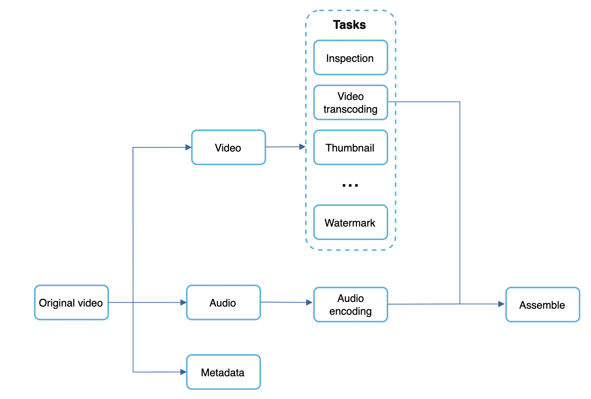
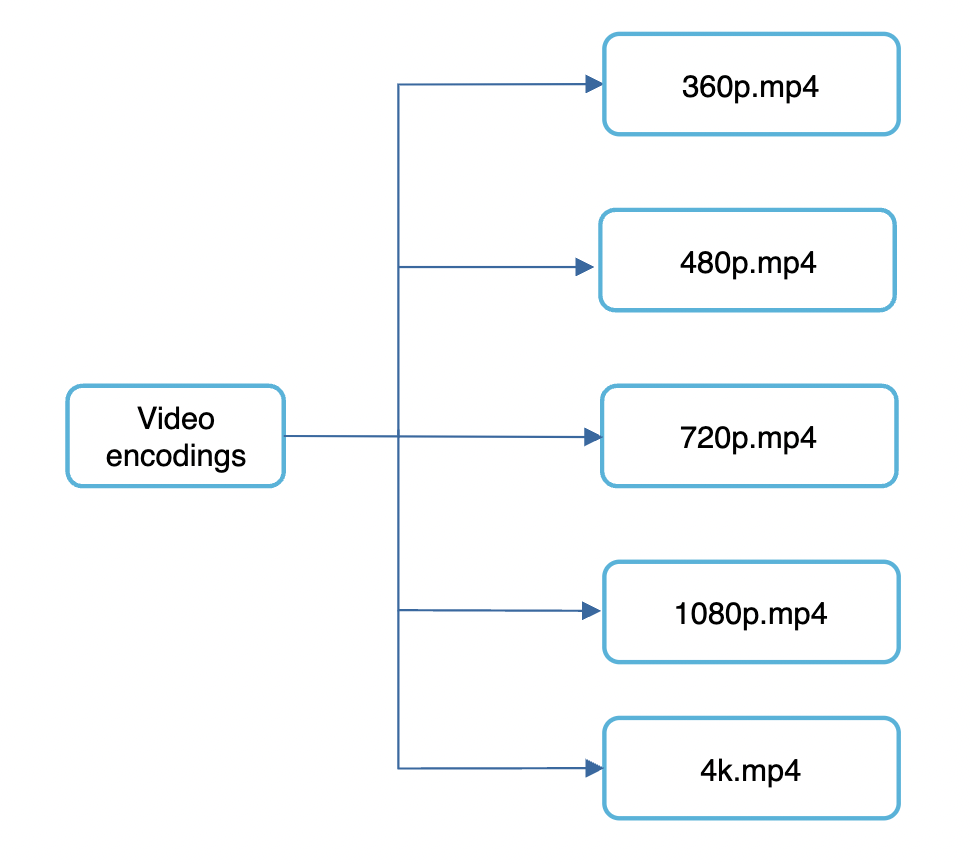
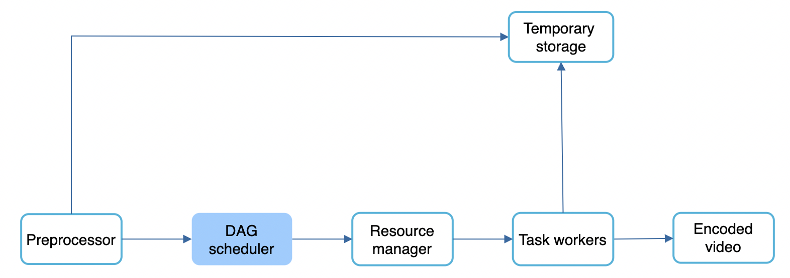
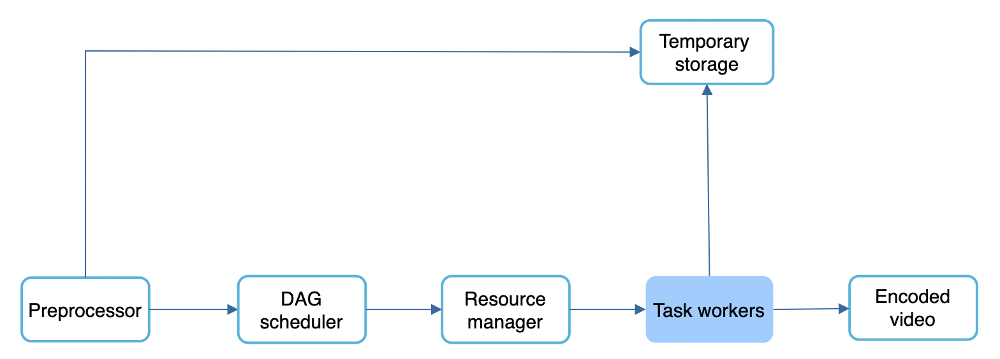
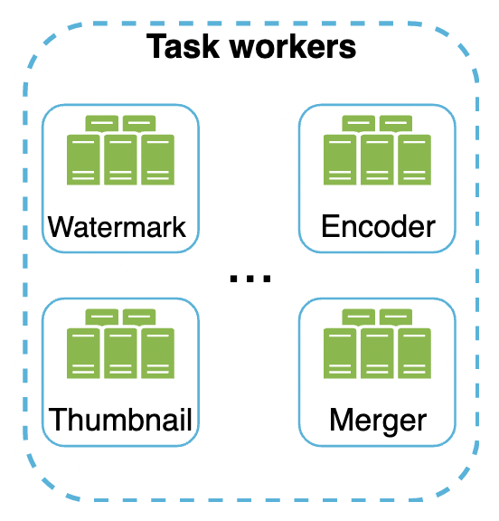
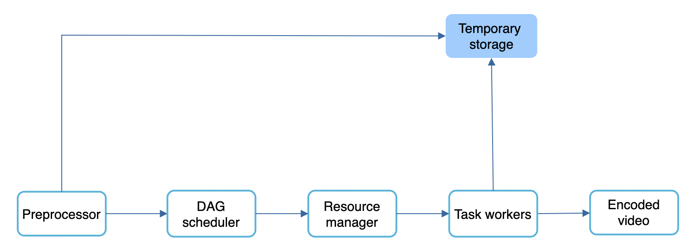
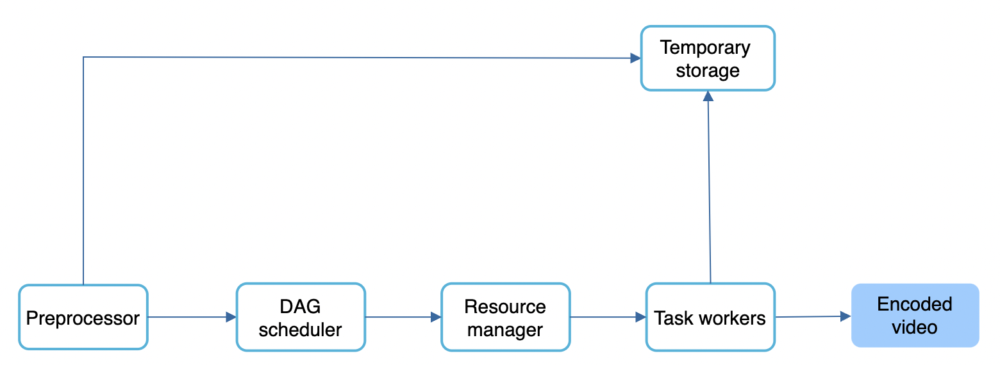
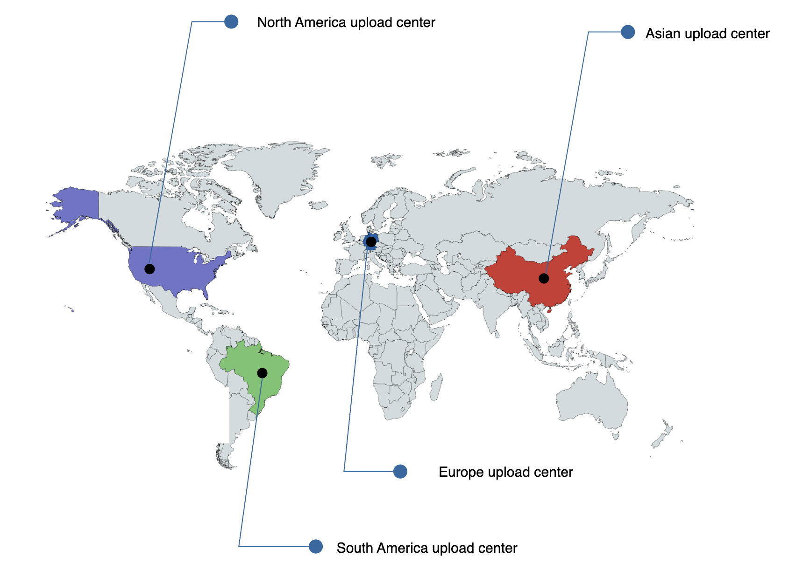
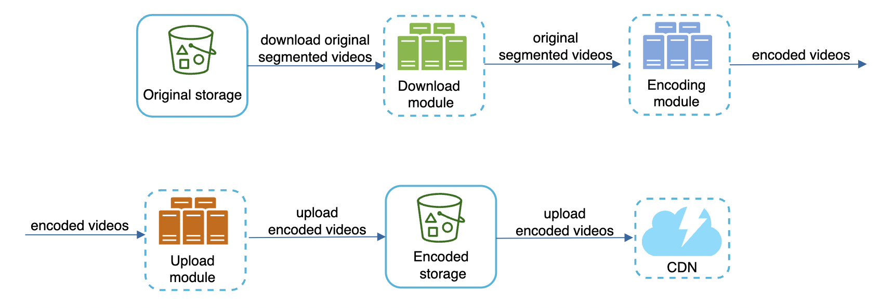
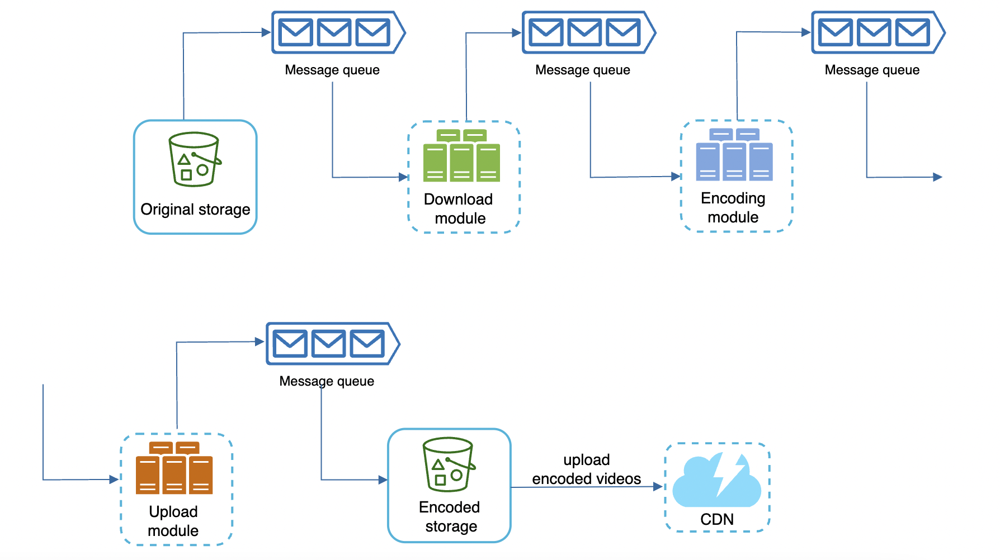

# Design YouTube
This chapter is about designing a video sharing platform such as youtube. Its solution can be applied to also eg designing Netflix, Hulu.

# Step 1 - Understand the problem and establish design scope
 * C: What features are important?
 * I: Upload video + watch video
 * C: What clients do we need to support?
 * I: Mobile apps, web apps, smart TV
 * C: How many DAUs do we have?
 * I: 5mil
 * C: Average time per day spend on YouTube?
 * I: 30m
 * C: Do we need to support international users?
 * I: Yes
 * C: What video resolutions do we need to support?
 * I: Most of them
 * C: Is encryption required?
 * I: Yes
 * C: File size requirement for videos?
 * I: Max file size is 1GB
 * C: Can we leverage existing cloud infra from Google, Amazon, Microsoft?
 * I: Yes, building everything from scratch is not a good idea.

Features, we'll focus on:
 * Upload videos fast
 * Smooth video streaming
 * Ability to change video quality
 * Low infrastructure cost
 * High availability, scalability, reliability
 * Supported clients - web, mobile, smart TV

## Back of the envelope estimation
 * Assume product has 5mil DAU
 * Users watch 5 videos per day
 * 10% of users upload 1 video per day
 * Average video size is 300mb
 * Daily storage cost needed - 5mil * 10% * 300mb = 150TB
 * CDN Cost, assuming 0.02$ per GB - 5mil * 5 videos * 0.3GB * 0.02$ = USD 150k per day
 
 

## Directed Acyclic Graph (DAG) model
Transcoding video is computationally expensive and time-consuming. 
In addition to that, different creators have different inputs - some provide thumbnails, others do not, some upload HD, others don't.

In order to support video processing pipelines, dev customisations, high parallelism, we adopt a DAG model:

Some of the tasks applied on a video file:
 * Ensure video has good quality and is not malformed
 * Video is encoded to support different resolutions, codecs, bitrates, etc.
 * Thumbnail is automatically added if a user doesn't specify it.
 * Watermark - image overlay on video if specified by creator

## Video transcoding architecture

### Preprocessor

The preprocessor's responsibilities:
 * Video splitting - video is split in group of pictures (GOP) alignment, ie arranged groups of chunks which can be played independently
 * Cache - intermediary steps are stored in persistent storage in order to retry on failure.
 * DAG generation - DAG is generated based on config files specified by programmers.

Example DAG configuration with two steps:

### DAG Scheduler

DAG scheduler splits a DAG into stages of tasks and puts them in a task queue, managed by a resource manager:

In this example, a video is split into video, audio and metadata stages which are processed in parallel.

### Resource manager

Resource manager is responsible for optimizing resource allocation.

 * Task queue is a priority queue of tasks to be executed
 * Worker queue is a queue of available workers and worker utilization info
 * Running queue contains info about currently running tasks and which workers they're assigned to

How it works:
 * task scheduler gets highest-priority task from queue
 * task scheduler gets optimal task worker to run the task
 * task scheduler instructs worker to start working on the task
 * task scheduler binds worker to task & puts task/worker info in running queue
 * task scheduler removes the job from the running queue once the job is done

### Task workers

The workers execute the tasks in the DAG. Different workers are responsible for different tasks and can be scaled independently.

### Temporary storage

Multiple storage systems are used for different types of data. Eg temporary images/video/audio is put in blob storage. Metadata is put in an in-memory cache as data size is small.

Data is freed up once processing is complete.

### Encoded video

Final output of the DAG. Example output - `funny_720p.mp4`.

## System Optimizations
Now it's time to introduce some optimizations for speed, safety, cost-saving.

### Speed optimization - parallelize video uploading
We can split video uploading into separate units via GOP alignment:

This enables fast resumable uploads if something goes wrong. Splitting the video file is done by the client.

### Speed optimization - place upload centers close to users

This can be achieved by leveraging CDNs.

### Speed optimization - parallelism everywhere
We can build a loosely coupled system and enable high parallelism.

Currently, components rely on inputs from previous components in order to produce outputs:

We can introduce message queues so that components can start doing their task independently of previous one once events are available:

### Safety optimization - pre-signed upload URL
To avoid unauthorized users from uploading videos, we introduce pre-signed upload URLs:

How it works:
 * client makes request to API server to fetch upload URL
 * API servers generate the URL and return it to the client
 * Client uploads the video using the URL

### Safety optimization - protect your videos
To protect creators from having their original content stolen, we can introduce some safety options:
 * Digital right management (DRM) systems - Apple FairPlay, Google Widevine, Microsoft PlayReady
 * AES encryption - you can encrypt a video and configure an authorization policy. It is decrypted on playback.
 * Visual watermarking - image overlay on top of video which contains your identifying information, eg company name.

### Cost-saving optimization
CDN is expensive, as we've seen in our back of the envelope estimation.

We can piggyback on the fact that video streams follow a long-tail distribution - ie a few popular videos are accessed frequently, but everything else is not.

Hence, we can store popular videos in CDN and serve everything else from high capacity storage servers:

Other cost-saving optimizations:
 * We might not need to store many encoded versions for less popular videos. Short videos can be encoded on-demand.
 * Some videos are only popular in certain regions. We can avoid distributing them in all regions.
 * Build your own CDN. Can make sense for large streaming companies like Netflix.

## Error Handling
For a large-scale system, errors are unavoidable. To make a fault-tolerant system, we need to handle errors gracefully and recover from them.

There are two types of errors:
 * Recoverable error - can be mitigated by retrying a few times. If retrying fails, a proper error code is returned to the client.
 * Non-recoverable error - system stops running related tasks and returns proper error code to the client.

Other typical errors and their resolution:
 * Upload error - retry a few times
 * Split video error - entire video is passed to server if older clients don't support GOP alignment.
 * Transcoding error - retry
 * Preprocessor error - regenerate DAG
 * DAG scheduler error - retry scheduling
 * Resource manager queue down - use a replica
 * Task worker down - retry task on different worker
 * API server down - they're stateless so requests can be redirected to other servers
 * Metadata db/cache server down - replicate data across multiple nodes
 * Master is down - Promote one of the slaves to become master
 * Slave is down - If slave goes down, you can use another slave for reads and bring up another slave instance

# Step 4 - Wrap up
Additional talking points:
 * Scaling the API layer - easy to scale horizontally as API layer is stateless
 * Scale the database - replication and sharding
 * Live streaming - our system is not designed for live streams, but it shares some similarities, eg uploading, encoding, streaming. Notable differences:
   * Live streaming has higher latency requirements so it might demand a different streaming protocol
   * Lower requirement for parallelism as small chunks of data are already processed in real time
   * different error handling, as there is a timeout after which we need to stop retrying
   * Video takedowns - videos that violate copyrights, pornography, any other illegal acts need to be removed either during upload flow or based on user flagging.
