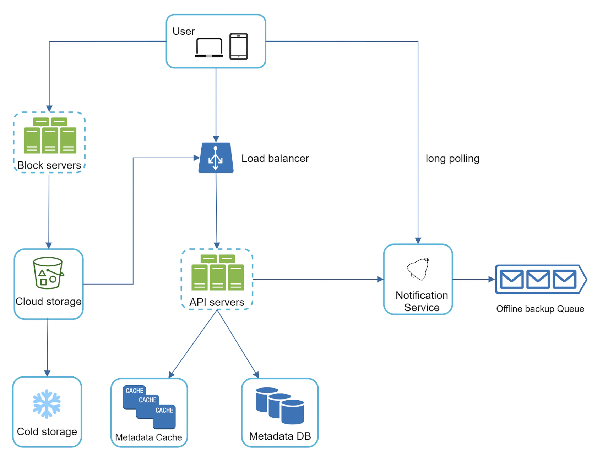
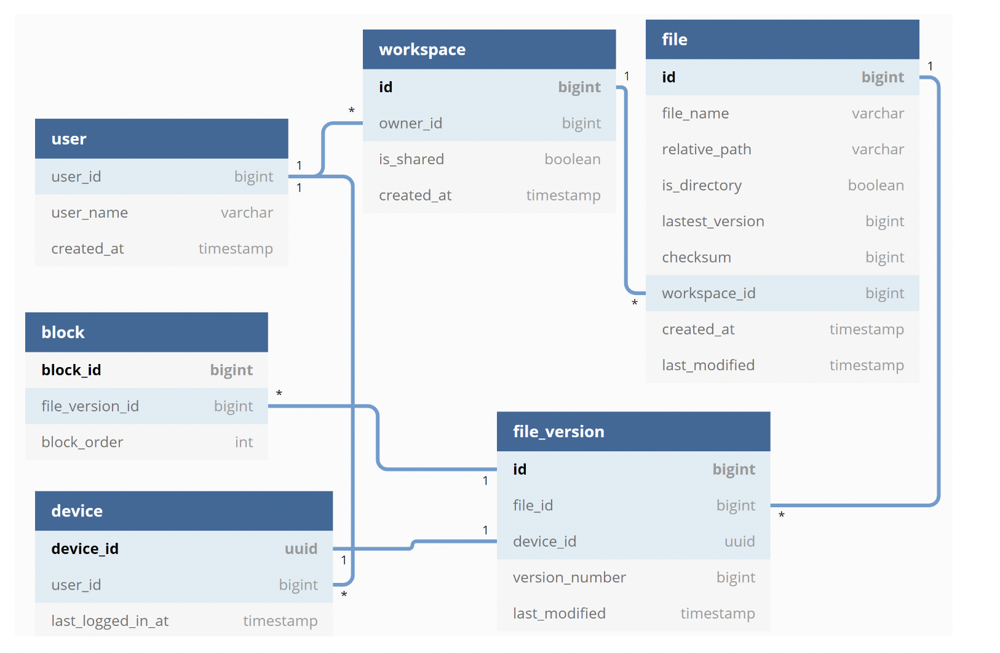

# Design Google Drive
Google Drive is a cloud file storage product, which helps you store documents, videos, etc from the cloud.

You can access them from any device and share them with friends and family.

# Step 1 - Understand the problem and establish design scope
 * C: What are most important features?
 * I: Upload/download files, file sync and notifications
 * C: Mobile or web?
 * I: Both
 * C: What are the supported file formats?
 * I: Any file type
 * C: Do files need to be encrypted?
 * I: Yes, files in storage need to be encrypted
 * C: Is the a file size limit?
 * I: Yes, files need to be 10 gb or smaller
 * C: How many users does the app have?
 * I: 10mil DAU

Features we'll focus on:
 * Adding files
 * Downloading files
 * Sync files across devices
 * See file revisions
 * Share file with friends
 * Send a notification when file is edited/deleted/shared

Features not discussed:
 * Collaborative editing

Non-functional requirements:
 * Reliability - data loss is unacceptable
 * Fast sync speed
 * Bandwidth usage - users will get unhappy if app consumes too much network traffic or battery
 * Scalability - we need to handle a lot of traffic
 * High availability - users should be able to use the system even when some services are down

## Back of the envelope estimation
 * Assume 50mil sign ups and 10mil DAU
 * Users get 10 gb free space
 * Users upload 2 files per day, average size is 500kb
 * 1:1 read-write ratio
 * Total space allocated - 50mil * 10gb = 500pb
 * QPS for upload API - 10mil * 2 uploads / 24h / 3600s = ~240
 * Peak QPS = 480

## APIs
**Upload file:**
```
https://api.example.com/files/upload?uploadType=resumable
```

This endpoint is used for uploading files with support for simple upload and resumable upload, which is used for large files.
Resumable upload is achieved by retrieving an upload URL and uploading the file while monitoring upload state. If disturbed, resume the upload.

**Download file:**
```
https://api.example.com/files/download
```

The payload specifies which file to download:
```
{
    "path": "/recipes/soup/best_soup.txt"
}
```

**Get file revisions:**
```
https://api.example.com/files/list_revisions
```

params:
 * path to file for which revision history is retrieved
 * maximum number of revisions to return

All the APIs require authentication and use HTTPS.

## Sync conflicts
Once the user base grows sufficiently, sync conflicts are unavoidable.

To address this, we can apply a strategy where the first who manages to modify a file first wins:


What happens once you get a conflict? We generate a second version of the file which represents the alternative file version and it's up to the user to merge it:


## High-level design

 * User uses the application through a browser or a mobile app
 * Block servers upload files to cloud storage. Block storage is a technology which allows you to split a big file in blocks and store the blocks in a backing storage. Dropbox, for example, stores blocks of size 4mb.
 * Cloud storage - a file split into multiple blocks is stored in cloud storage
 * Cold storage - used for storing inactive files, infrequently accessed.
 * Load balancer - evenly distributes requests among API servers.
 * API servers - responsible for anything other than uploading files. Authentication, user profile management, updating file metadata, etc.
 * Metadata database - stores metadata about files uploaded to cloud storage.
 * Metadata cache - some of the metadata is cached for fast retrieval.
 * Notification service - Publisher/subscriber system which notifies users when a file is updated/edited/removed so that they can pull the latest changes.
 * Offline backup queue - used to queue file changes for users who are offline so that they can pull them once they come back online.

## Metadata database
Here's a simplified table schema for the metadata db (only interesting fields are shown):

 * User table contains basic information about the user such as username, email, profile photo, etc.
 * Device table stores device info. Push_id is used for sending push notifications. Users can have multiple devices.
 * Namespace - root directory of a user
 * File table stores everything related to a file
 * File_version stores the version history of a file. Existing fields are read-only to sustain file integrity.
 * Block - stores everything related to a file block. A file version can be reconstructed by joining all blocks in the correct version.

## Upload flow


In the above flow, two requests are sent in parallel - updating file metadata and uploading the file to cloud storage.

**Add file metadata:**
 * Client 1 sends request to update file metadata
 * New file metadata is stored and upload status is set to "pending"
 * Notify the notification service that a new file is being added.
 * Notification service notifies relevant clients about the file upload.

**Upload files to cloud storage:**
 * Client 1 uploads file contents to block servers
 * Block servers chunk the file in blocks, compresses, encrypts them and uploads to cloud storage
 * Once file is uploaded, upload completion callback is triggered. Request is sent to API servers.
 * File status is changed to "uploaded" in Metadata DB.
 * Notification service is notified of file uploaded event and client 2 is notified about the new file.

## Download flow
Download flow is triggered when file is added or edited elsewhere. Client is notified via:
 * Notification if online
 * New changes are cached until user comes online if offline at the moment

Once a client is notified of the changes, it requests the file metadata and then downloads the blocks to reconstruct the file:

 * Notification service informs client 2 of file changes
 * Client 2 fetches metadata from API servers
 * API servers fetch metadata from metadata DB
 * Client 2 gets the metadata
 * Once client receives the metadata, it sends requests to block servers to download blocks
 * Block servers download blocks from cloud storage and forwards them to the client

## Notification service
The notification service enables file changes to be communicated to clients as they happen.

Clients can communicate with the notification service via:
 * long polling (eg Dropbox uses this approach)
 * Web sockets - communication is persistent and bidirectional

Both options work well but we opt for long polling because:
 * Communication for notification service is not bi-directional. Server sends information to clients, not vice versa.
 * WebSocket is meant for real-time bidirectional communication. For google drive, notifications are sent infrequently.

With long polling, the client sends a request to the server which stays open until a change is received or timeout is reached. 
After that, a subsequent request is sent for next couple of changes.

## Save storage space
To support file version history and ensure reliability, multiple versions of a file are stored across multiple data centers.

Storage space can be filled up quickly. Three techniques can be applied to save storage space:
 * De-duplicate data blocks - if two blocks have the same hash, we can only store them once.
 * Adopt an intelligent backup strategy - set a limit on max version history and aggregate frequent edits into a single version.
 * Move infrequently accessed data to cold storage - eg Amazon S3 glacier is a good option for this, which is much cheaper than Amazon S3.

## Failure handling
Some typical failures and how you could resolve them:
 * Load balancer failure - If a load balancer fails, a secondary becomes active and picks up the traffic.
 * Block server failure - If a block server fails, other replicas pick up the traffic and finish the job.
 * Cloud storage failure - S3 buckets are replicated across regions. If one region fails, traffic is redirected to the other one.
 * API server failure - Traffic is redirected to other service instances by the load balancer.
 * Metadata cache failure - Metadata cache servers are replicated multiple times. If one goes down, other nodes are still available.
 * Metadata DB failure - if master is down, promote one of the slaves to be master. If slave is down, use another one for read operations.
 * Notification service failure - If long polling connections are lost, clients reconnect to a different service replica, but reconnection of millions of clients will take some time.
 * Offline backup queue failure - Queues are replicated multiple times. If one queue fails, consumers need to resubscribe to the backup queue.

# Step 4 - Wrap up
Properties of our Google Drive system design in a nutshell:
 * Strongly consistent
 * Low network bandwidth
 * Fast sync

Our design contains two flows - file upload and file sync.

If time permits, you could discuss alternative design approaches as there is no perfect design.
For example, we can upload blocks directly to cloud storage instead of going through block servers. 

This is faster than our approach but has drawbacks:
 * Chunking, compression, encryption need to be implemented on different platforms (Android, iOS, Web). 
 * Client can be hacked so implementing encryption client-side is not ideal.

Another interesting discussion is moving online/offline logic to separate service so that other services can reuse it to implement interesting functionality.

