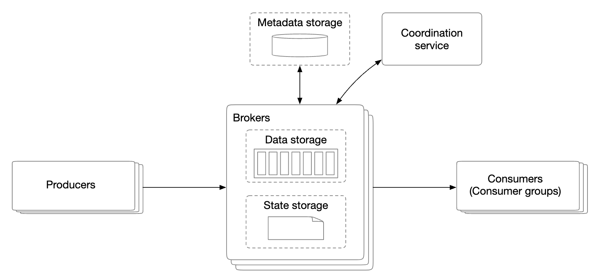
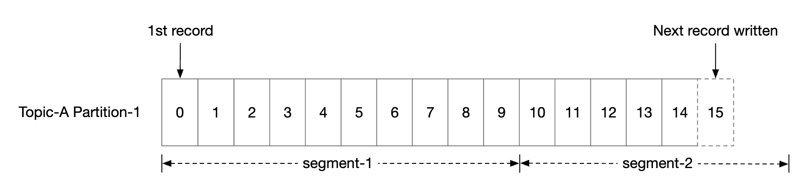
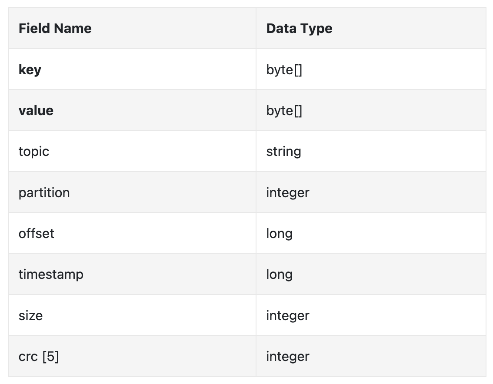
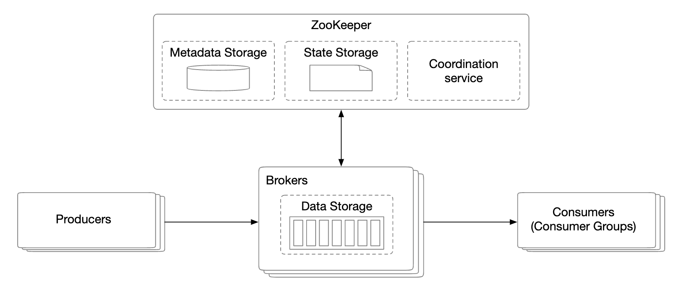

# Distributed Message Queue
We'll be designing a distributed message queue in this chapter.

Benefits of message queues:
 * Decoupling - Eliminates tight coupling between components. Let them update separately.
 * Improved scalability - Producers and consumers can be scaled independently based on traffic.
 * Increased availability - If one part of the system goes down, other parts continue interacting with the queue.
 * Better performance - Producers can produce messages without waiting for consumer confirmation.

Some popular message queue implementations - Kafka, RabbitMQ, RocketMQ, Apache Pulsar, ActiveMQ, ZeroMQ.

Strictly speaking, Kafka and Pulsar are not message queues. They are event streaming platforms.
There is however a convergence of features which blurs the distinction between message queues and event streaming platforms.

In this chapter, we'll be building a message queue with support for more advanced features such as long data retention, repeated message consumption, etc.

# Step 1 - Understand the problem and establish design scope
Message queues ought to support few basic features - producers produce messages and consumers consume them.
There are, however, different considerations with regards to performance, message delivery, data retention, etc.

Here's a set of potential questions between Candidate and Interviewer:
 * C: What's the format and average message size? Is it text only?
 * I: Messages are text-only and usually a few KBs
 * C: Can messages be repeatedly consumed?
 * I: Yes, messages can be repeatedly consumed by different consumers. This is an added requirement, which traditional message queues don't support.
 * C: Are messages consumed in the same order they were produced?
 * I: Yes, order guarantee should be preserved. This is an added requirement, traditional message queues don't support this.
 * C: What are the data retention requirements?
 * I: Messages need to have a retention of two weeks. This is an added requirement.
 * C: How many producers and consumers do we want to support?
 * I: The more, the better.
 * C: What data delivery semantic do we want to support? At-most-once, at-least-once, exactly-once?
 * I: We definitely want to support at-least-once. Ideally, we can support all and make them configurable.
 * C: What's the target throughput for end-to-end latency?
 * I: It should support high throughput for use cases like log aggregation and low throughput for more traditional use cases.

Functional requirements:
 * Producers send messages to a message queue
 * Consumers consume messages from the queue
 * Messages can be consumed once or repeatedly
 * Historical data can be truncated
 * Message size is in the KB range
 * Order of messages needs to be preserved
 * Data delivery semantics is configurable - at-most-once/at-least-once/exactly-once.

Non-functional requirements:
 * High throughput or low latency. Configurable based on use-case
 * Scalable - system should be distributed and support a sudden surge in message volume
 * Persistent and durable - data should be persisted on disk and replicated among nodes

Traditional message queues typically don't support data retention and don't provide ordering guarantees. This greatly simplifies the design and we'll discuss it.

## Messaging models
The first type of messaging model is point-to-point and it's commonly found in traditional message queues:

 * A message is sent to a queue and it's consumed by exactly one consumer.
 * There can be multiple consumers, but a message is consumed only once.
 * Once message is acknowledged as consumed, it is removed from the queue.
 * There is no data retention in the point-to-point model, but there is such in our design.

On the other hand, the publish-subscribe model is more common for event streaming platforms:

 * Messages are replicated per consumer group (not per consumer).
 * Each consumer group maintains its own offset.
 * Reading messages in parallel by a consumer group improves throughput but hampers the ordering guarantee.
 * This can be mitigated by only allowing one consumer from a group to be subscribed to a partition. 
 * This means that we can't have more consumers in a group than there are partitions.

## High-level architecture

 * Clients are producer and consumer. Producer pushes messages to a designated topic. Consumer group subscribes to messages from a topic.
 * Brokers hold multiple partitions. A partition holds a subset of messages for a topic.
 * Data storage stores messages in partitions.
 * State storage keeps the consumer states.
 * Metadata storage stores configuration and topic properties
 * The coordination service is responsible for service discovery (which brokers are alive) and leader election (which broker is leader, responsible for assigning partitions).

# Step 3 - Design Deep Dive
## Data storage
In order to find the best data store for messages, we must examine a message's properties:
 * Write-heavy, read-heavy
 * No update/delete operations. In traditional message queues, there is a "delete" operation as messages are not retained.
 * Predominantly sequential read/write access pattern.

What are our options:
 * Database - not ideal as typical databases don't support well both write and read heavy systems.
 * Write-ahead log (WAL) - a plain text file which only supports appending to it and is very HDD-friendly. 
   * We split partitions into segments to avoid maintaining a very large file.
   * Old segments are read-only. Writes are accepted by latest segment only.

WAL files are extremely efficient when used with traditional HDDs. 

There is a misconception that HDD acces is slow, but that hugely depends on the access pattern.
When the access pattern is sequential (as in our case), HDDs can achieve several MB/s write/read speed which is sufficient for our needs.
We also piggyback on the fact that the OS caches disk data in memory aggressively.

## Message data structure
It is important that the message schema is compliant between producer, queue and consumer to avoid extra copying. This allows much more efficient processing.

Example message structure:

The key of the message specifies which partition a message belongs to. An example mapping is `hash(key) % numPartitions`.
For more flexibility, the producer can override default keys in order to control which partitions messages are distributed to.

The message value is the payload of a message. It can be plaintext or a compressed binary block.

**Note:** Message keys, unlike traditional KV stores, need not be unique. It is acceptable to have duplicate keys and for it to even be missing.

Other message files:
 * Topic - topic the message belongs to
 * Partition - The ID of the partition a message belongs to
 * Offset - The position of the message in a partition. A message can be located via `topic`, `partition`, `offset`.
 * Timestamp - When the message is stored
 * Size - the size of this message
 * CRC - checksum to ensure message integrity

Additional features such as filtering can be supported by adding additional fields.

## Batching
Batching is critical for the performance of our system. We apply it in the producer, consumer and message queue.

It is critical because:
 * It allows the operating system to group messages together, amortizing the cost of expensive network round trips
 * Messages are written to the WAL in groups sequentially, which leads to a lot of sequential writes and disk caching.

There is a trade-off between latency and throughput:
 * High batching leads to high throughput and higher latency. 
 * Less batching leads to lower throughput and lower latency.

If we need to support lower latency since the system is deployed as a traditional message queue, the system could be tuned to use a smaller batch size.

If tuned for throughput, we might need more partitions per topic to compensate for the slower sequential disk write throughput.

## Consumer rebalancing
Consumer rebalancing is responsible for deciding which consumers are responsible for which partition.

This process occurs when a consumer joins/leaves or a partition is added/removed.
When the coordinator stops receiving heartbeats from the consumers in a group, a rebalancing is triggered:

## State storage
The state storage stores mapping between partitions and consumers, as well as the last consumed offsets for a partition.

Group 1's offset is at 6, meaning all previous messages are consumed. If a consumer crashes, the new consumer will continue from that message on wards.
 
Data access patterns for consumer states:
 * Frequent read/write operations, but low volume
 * Data is updated frequently, but rarely deleted
 * Random read/write
 * Data consistency is important

Given these requirements, a fast KV storage like Zookeeper is ideal.

## Metadata storage
The metadata storage stores configuration and topic properties - partition number, retention period, replica distribution.

Metadata doesn't change often and volume is small, but there is a high consistency requirement.
Zookeeper is a good choice for this storage.

## ZooKeeper
Zookeeper is essential for building distributed message queues.

It is a hierarchical key-value store, commonly used for a distributed configuration, synchronization service and naming registry (ie service discovery).

# Step 4 - Wrap up
Additional talking points:
 * Protocol of communication. Important considerations - support all use-cases and high data volume, as well as verify message integrity. Popular protocols - AMQP and Kafka protocol.
 * Retry consumption - if we can't process a message immediately, we could send it to a dedicated retry topic to be attempted later.
 * Historical data archive - old messages can be backed up in high-capacity storages such as HDFS or object storage (eg S3).
